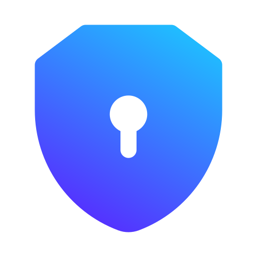
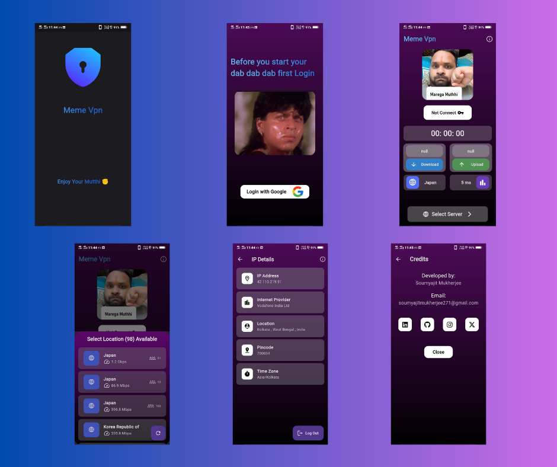

 

  <h1 align="center">Meme Vpn </h1>

  

     Flutter VPN app, designed to revolutionize your browsing experience while ensuring your privacy and entertainment needs are met seamlessly. Developed as an open-source project, our app is committed to transparency and community-driven improvement, ensuring users have full control over their online activities without intrusive advertisements.
     
     
    
    ·
    <a href="https://github.com/Sm69mu/meme_vpn/issues">Report Bug</a>
    ·
    <a href="https://github.com/Sm69mu/meme_vpn/issues">Request Feature</a>
    .
     
     
  

## ⚠ Note

### *The application is still under development and this is a pre-release version!*

The current version of the application is a pre-release and is intended to use as a proof of conecpt. Developers assume no liability and are not responsible for any misuse or damage caused by the current version of the application.

## App Screenshots

  

## Built With

* 

* 

* 

* 

(<a href="#readme-top">back to top</a>)

## How to use

Head over the releases tab for this project and download the (Meme vpn.apk) file for the latest release.

(<a href="#readme-top">back to top</a>)

## Contributing

Contributions are what make the open source community such an amazing place to learn, inspire, and create. Any contributions you make are **greatly appreciated**.

If you have a suggestion that would make this better, please fork the repo and create a pull request. You can also simply open an issue with the tag "enhancement".
Don't forget to give the project a star!

(<a href="#readme-top">back to top</a>)

## 🚀 About Me

Hi I am [Soumyajit Mukherjee](https://github.com/Sm69mu) & I'm a Flutter developer.
